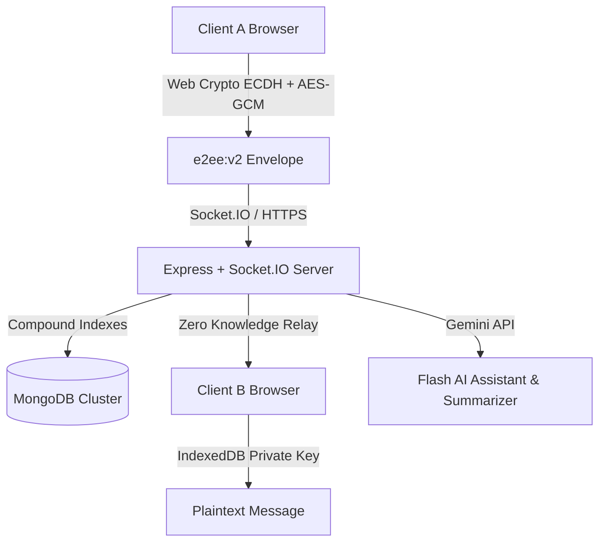

# ⚡ Flash Chat — Production-Grade Secure Real-Time Messaging

[]()
[]()
[]()
[]()
[]()
[]()
[]()

Flash Chat is a modern, enterprise-ready real-time communication platform built for speed, uncompromising privacy, and seamless user experiences.

---

## 🌟 Key Highlights & Architecture



### 🔐 True Asymmetric End-to-End Encryption (E2EE)
- **Elliptic Curve Cryptography**: Uses browser-native **Web Crypto ECDH** (Curve P-256) + **HKDF-SHA256** to derive conversation keys without central key knowledge.
- **Hardware-Isolated Keystore**: Private keys are generated on-device and persisted in **IndexedDB** (`FlashChat_E2EE_Keystore`), remaining non-extractable.
- **Envelope Protocol**: Messages are packaged into standard `e2ee:v2:<iv>:<public_key>:<ciphertext>` envelopes for instant zero-roundtrip decryption across browsers and devices.

### 🛡️ Hardened Authentication & Session Lifecycle
- **Short-Lived JWTs**: 15-minute access tokens delivered via `HttpOnly`, `SameSite=Strict` cookies.
- **Rotating Refresh Tokens**: 7-day rotating refresh tokens backed by database-tracked `activeSessions`.
- **Multi-Device Session Management**: Users can inspect active device logins (IP, OS/Browser, last active timestamp) and remotely revoke individual sessions or log out from all other devices.
- **Automatic Token Refresh**: Axios response interceptors transparently refresh expired tokens and retry queued requests without disrupting the user.

### 💬 Real-Time Chat Engine
- **Voice Notes**: In-app audio recorder with waveform visualizer and custom sleek audio player.
- **Group Invite Links**: Shareable `/join/:inviteCode` links with preview modal and real-time membership synchronization.
- **In-Chat Message Search**: Search through conversation histories with instant match highlighting.
- **Pinned Messages**: WhatsApp-style pinned message header with click-to-scroll navigation.
- **Forwarding & Reactions**: Forward messages to multiple contacts simultaneously; interact with fast emoji reactions and threaded replies.
- **Delivery & Read Receipts**: Real-time tick statuses (`sent` ➔ `delivered` ➔ `seen`) with typing indicators.

### 🤖 Flash AI Intelligence
- **Flash AI Bot**: Conversational companion powered by **Google Gemini Flash** with an offline local heuristic fallback.
- **Thread Summarizer**: Instant bullet-point conversation summaries with action-item extraction.
- **Smart Rewriter**: Tone adjuster (professional, concise, friendly, casual).

### ☁️ User-Friendly Encrypted Backups
- **PBKDF2 Password Protection**: Backups are encrypted client-side using PBKDF2 (100,000 rounds) + AES-256-GCM.
- **Pre-Restore Preview**: Modal inspecting message counts, conversation totals, and export timestamps.
- **Restore Strategies**: Choose between non-destructive **Merge with existing chats** or **Complete replacement**.

---

## 📁 Repository Structure

```
Flash-chat/
├── backend/
│   ├── config/            # Database & Cloudinary configurations
│   ├── controllers/       # Auth, Chat, User, Conversation controllers
│   ├── middleware/        # JWT authMiddleware, Rate-limiters, Multer
│   ├── models/            # Mongoose schemas (User, Message, Conversation)
│   ├── routes/            # REST API endpoints
│   ├── services/          # Socket.io, Gemini AI, Twilio SMS services
│   ├── tests/             # Automated security and token test suite
│   └── utils/             # Response handler, token generators, crypto helpers
├── frontend/
│   ├── src/
│   │   ├── components/    # ChatWindow, ContactsPanel, AudioPlayer, VoiceRecorder
│   │   ├── pages/         # Login, Setting, Status, JoinGroup
│   │   ├── store/         # Zustand global stores (chat, user, theme)
│   │   ├── services/      # Axios client with auto-refresh interceptors
│   │   └── utils/         # E2EE Web Crypto engine & backup decoders
├── .gitignore             # Hardened rules excluding node_modules & secrets
├── SECURITY.md            # Security policy & cryptographic disclosure
└── README.md
```

---

## 🚀 Quick Start

### Prerequisites
- Node.js 18+
- MongoDB instance (local or Atlas)

### 1. Clone & Configure Environment

```bash
git clone https://github.com/Gulshankartikk/Flash-chat.git
cd Flash-chat
```

#### Backend Setup:
```bash
cd backend
cp .env.example .env
npm install
npm run dev
```

#### Frontend Setup:
```bash
cd ../frontend
cp .env.example .env
npm install
npm start
```

Open `http://localhost:3000` in your browser.

---

## 🧪 Running Automated Tests

Run the security and cryptographic test suite:

```bash
cd backend
npm test
```

---

## 📡 API Reference Overview

| Method | Endpoint | Description | Auth Required |
|---|---|---|---|
| `POST` | `/api/auth/send-otp` | Sends SMS or email OTP | No |
| `POST` | `/api/auth/verify-otp` | Verifies OTP, sets session cookies | No |
| `POST` | `/api/auth/refresh-token` | Rotates refresh token & issues new access token | Yes (Cookie) |
| `POST` | `/api/auth/logout` | Revokes current device session | Yes |
| `GET` | `/api/users/sessions` | Lists active device sessions | Yes |
| `DELETE` | `/api/users/sessions/:id`| Revokes specific session | Yes |
| `DELETE` | `/api/users/sessions/other`| Revokes all other sessions | Yes |
| `GET` | `/api/conversations/:id/invite-link` | Generates group invite link | Yes |
| `POST` | `/api/conversations/join/:code` | Joins group via invite code | Yes |
| `POST` | `/api/chat/ai/summarize` | Generates Gemini AI summary of chat thread | Yes |
| `POST` | `/api/chat/ai/rewrite` | Rewrites draft message in target tone | Yes |
| `GET` | `/api/health` | Service health, uptime & DB status | No |

---

## 📄 License
Distributed under the MIT License.
