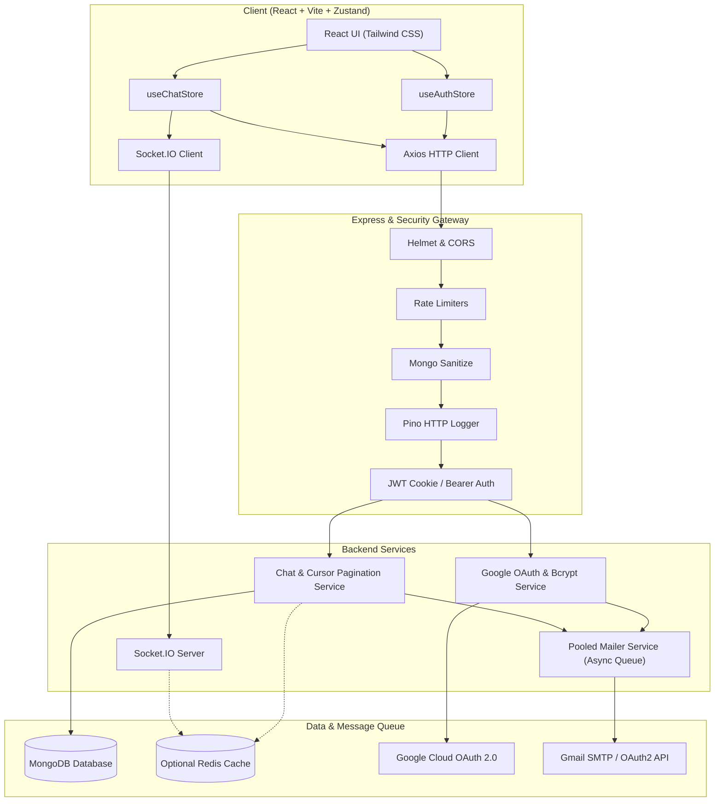

# ⚡ Flash Chat

> Complete, production-grade, real-time messaging platform powered by React + Vite, Node.js, Express, Socket.IO, and MongoDB. Features Google OAuth 2.0 authorization, Gmail Nodemailer notifications with retry queuing, presence tracking, and cursor-based infinite scroll.

---

## 1. Project Overview & Features

Flash Chat is built from the ground up for speed, reliability, and security.

### Core Features
- 🚀 **Real-Time 1-to-1 & Group Messaging**: Sub-millisecond message delivery via tuned Socket.IO websockets.
- 🔐 **Dual Auth Matrix**: Google OAuth 2.0 ("Authorize / Continue with Google") + JWT in secure `httpOnly` cookies with bcrypt password fallback.
- 📧 **Gmail & Nodemailer Integration**: Singleton pooled transporter (`pool: true`) supporting Gmail OAuth2 refresh tokens and 16-character App Password fallbacks with exponential backoff retries.
- 🟢 **Presence & Indicators**: Instant online/offline status detection, typing broadcast, and read receipts (`✓` Sent, `✓✓` Delivered, `✓✓` Blue Read).
- 📜 **Cursor-based Message Pagination**: Infinite scroll upwards with zero skipped messages and fast indexed queries.
- 📎 **Rich Media & Attachments**: Image previews, audio playback, file downloads, and emoji picker.
- ✏️ **Message Lifecycle**: In-place edit with `(edited)` indicator and soft-deletion (`isDeleted`).
- 🌓 **Dynamic Theme Engine**: Dark & Light mode toggle with CSS tokens and local storage persistence.
- 🛡️ **Enterprise Security**: Helmet HTTP headers, CORS whitelisting, Express rate limiting, and NoSQL injection sanitization (`express-mongo-sanitize`).
- ⚡ **Zero-Config Developer Experience**: Install once with `npm run install:all` and run with `npm run dev`.

---

## 2. Tech Stack & Architecture Diagram

### Technology Stack
- **Frontend**: React 18, Vite, Tailwind CSS, Zustand, React Router v6, Socket.IO Client, Lucide Icons, Date-fns.
- **Backend**: Node.js (LTS), Express 4, Socket.IO 4, Mongoose 8, Nodemailer, Pino & Pino-HTTP, Google Auth Library, Zod.
- **Database & Cache**: MongoDB (Mongoose with `.lean()` queries & composite indexes), Optional Redis adapter.

### Architecture Diagram (Mermaid)


```mermaid
graph TD
    subgraph Client ["Client (React + Vite + Zustand)"]
        UI["React UI (Tailwind CSS)"]
        ZustandAuth["useAuthStore"]
        ZustandChat["useChatStore"]
        SocketClient["Socket.IO Client"]
        AxiosClient["Axios HTTP Client"]
    end

    subgraph Gateway ["Express & Security Gateway"]
        Helmet["Helmet & CORS"]
        RateLimiter["Rate Limiters"]
        MongoSanitize["Mongo Sanitize"]
        PinoLogger["Pino HTTP Logger"]
        AuthMiddleware["JWT Cookie / Bearer Auth"]
    end

    subgraph BackendServices ["Backend Services"]
        SocketServer["Socket.IO Server"]
        ChatService["Chat & Cursor Pagination Service"]
        AuthService["Google OAuth & Bcrypt Service"]
        MailerService["Pooled Mailer Service (Async Queue)"]
    end

    subgraph DataStorage ["Data & Message Queue"]
        MongoDB[(MongoDB Database)]
        RedisCache[(Optional Redis Cache)]
        GoogleOAuth[Google Cloud OAuth 2.0]
        GmailSMTP[Gmail SMTP / OAuth2 API]
    end

    UI --> ZustandAuth
    UI --> ZustandChat
    ZustandAuth --> AxiosClient
    ZustandChat --> SocketClient
    ZustandChat --> AxiosClient

    AxiosClient --> Helmet
    SocketClient --> SocketServer

    Helmet --> RateLimiter --> MongoSanitize --> PinoLogger --> AuthMiddleware
    AuthMiddleware --> AuthService
    AuthMiddleware --> ChatService
    AuthService --> GoogleOAuth

    ChatService --> MongoDB
    ChatService -.-> RedisCache
    SocketServer -.-> RedisCache

    AuthService --> MailerService
    ChatService --> MailerService
    MailerService --> GmailSMTP
```

---

## 3. Prerequisites

- **Node.js**: `v18.x` or `v20.x` LTS
- **npm**: `v9.x` or higher
- **MongoDB**: Local MongoDB instance running on `mongodb://localhost:27017` or MongoDB Atlas URI
- **Redis (Optional)**: If you plan to scale Socket.IO across multiple server instances (standalone mode runs in-memory with zero extra dependencies)

---

## 4. Step-by-Step Installation & Running Instructions

### Step 1: Clone the repository
```bash
git clone https://github.com/Gulshankartikk/Flash-chat.git
cd Flash-chat
```

### Step 2: Install dependencies for root, server, and client
```bash
npm run install:all
```

### Step 3: Configure Environment Variables
Copy `.env.example` to `.env` (or configure `server/.env` and `client/.env`):
```bash
# On Windows PowerShell:
Copy-Item .env.example server/.env
Copy-Item client/.env.example client/.env

# On Linux/macOS:
cp .env.example server/.env
cp client/.env.example client/.env
```

### Step 4: Start the application in development mode
```bash
npm run dev
```
Both the Backend (`http://localhost:5000`) and Vite Frontend (`http://localhost:5173`) will boot up concurrently.

### Step 5: Production Build and Run
```bash
npm run build
npm start
```

---

## 5. Complete Environment Variable Table

| Variable | Required | Default | Description |
| :--- | :---: | :--- | :--- |
| `NODE_ENV` | No | `development` | Environment mode (`development`, `production`, `test`) |
| `PORT` | No | `5000` | HTTP & WebSocket server port |
| `MONGO_URI` | **Yes** | `mongodb://localhost:27017/flashchat` | Connection URI for MongoDB |
| `JWT_SECRET` | **Yes** | — | Cryptographic secret for signing JWT cookies (min 16 chars) |
| `CLIENT_URL` | No | `http://localhost:5173` | Allowed CORS origin and redirect target |
| `GOOGLE_CLIENT_ID` | Optional | `""` | Google Cloud OAuth 2.0 Web Client ID |
| `GOOGLE_CLIENT_SECRET` | Optional | `""` | Google Cloud OAuth 2.0 Web Client Secret |
| `GOOGLE_REDIRECT_URI` | Optional | `http://localhost:5000/api/auth/google/callback` | Authorized redirect URI for Google OAuth |
| `GMAIL_USER` | Optional | `""` | Gmail address for sending system emails |
| `GMAIL_REFRESH_TOKEN`| Optional | `""` | OAuth2 Refresh Token for Gmail SMTP |
| `GMAIL_APP_PASSWORD` | Optional | `""` | 16-character Google App Password (fallback) |
| `LOG_LEVEL` | No | `info` | Pino log level (`fatal`, `error`, `warn`, `info`, `debug`, `trace`) |
| `REDIS_URL` | Optional | `""` | Redis connection URI for caching and socket adapter |

---

## 6. Google Cloud Console & Gmail Setup Guide

### Step 6.1: Google Cloud Project & OAuth Consent
1. Visit the [Google Cloud Console](https://console.cloud.google.com/).
2. Create a new project called **Flash Chat**.
3. Navigate to **APIs & Services > OAuth consent screen**:
   - User Type: **External**.
   - App Name: `Flash Chat`.
   - User Support Email: Your Gmail.
   - Developer Contact Information: Your Gmail.
   - Scopes: Add `.../auth/userinfo.email`, `.../auth/userinfo.profile`, and `openid`.
   - Test Users: Add your test Gmail address while the app is in "Testing" mode.

### Step 6.2: Create OAuth 2.0 Client ID
1. Navigate to **APIs & Services > Credentials > Create Credentials > OAuth client ID**.
2. Application type: **Web application**.
3. Name: `Flash Chat Web Client`.
4. Authorized JavaScript origins:
   - `http://localhost:5173`
   - `http://localhost:5000`
5. Authorized redirect URIs:
   - `https://developers.google.com/oauthplayground` (required for generating refresh token)
   - `http://localhost:5000/api/auth/google/callback`
6. Click **Create** and save your `Client ID` and `Client Secret`.
7. Paste `Client ID` into `server/.env` (`GOOGLE_CLIENT_ID`) and `client/.env` (`VITE_GOOGLE_CLIENT_ID`).

### Step 6.3: Option A — Generate Gmail OAuth2 Refresh Token
1. Enable the **Gmail API** in Google Cloud Console (**APIs & Services > Library > Gmail API > Enable**).
2. Open the [Google OAuth 2.0 Playground](https://developers.google.com/oauthplayground).
3. Click the gear icon (⚙️) on the top right:
   - Check **Use your own OAuth credentials**.
   - Enter your `OAuth Client ID` and `OAuth Client Secret`.
4. In Step 1 on the left panel, paste: `https://mail.google.com/` and click **Authorize APIs**.
5. Log into your Google account and grant permissions.
6. In Step 2, click **Exchange authorization code for tokens**.
7. Copy the **Refresh token** value and paste it into `server/.env` as `GMAIL_REFRESH_TOKEN`.

### Step 6.4: Option B — App Password (Fastest Alternative)
If you prefer not using OAuth tokens:
1. Ensure **2-Step Verification** is enabled on your Google account.
2. Visit [Google App Passwords](https://myaccount.google.com/apppasswords).
3. App name: `Flash Chat`.
4. Click **Create** to receive a 16-character code (e.g., `jotadqiqezozmpiw`).
5. Set `GMAIL_APP_PASSWORD=your_16_char_code` and `GMAIL_USER=your_email@gmail.com` in `server/.env`.

---

## 7. Nodemailer Setup & Email Events

Flash Chat employs a singleton `mailerService` with connection pooling (`pool: true`) and automatic retry with exponential backoff.

### Email Events Table

| Event | Trigger | Template | Behavior |
| :--- | :--- | :--- | :--- |
| **Welcome Email** | Signup (Email or Google) | HTML + Text | Async via `setImmediate` |
| **Login Alert** | Every login | HTML + Text (IP, Device, Timestamp) | Dispatched immediately without blocking |
| **Email Verification** | OTP confirmation | HTML + Text (6-digit OTP code) | Expires in 10 minutes |
| **Password Reset** | Forgot password request | HTML + Text (Signed reset link) | 1 hour validity |
| **Offline Digest** | 5 unread messages while offline | HTML + Text (Message counter & sender) | Throttled threshold |

### Testing Email Sending via Dev API
Send a diagnostic email using the protected test endpoint:
```bash
curl -X POST http://localhost:5000/api/mail/test \
  -H "Content-Type: application/json" \
  -H "Authorization: Bearer <YOUR_JWT_TOKEN>" \
  -d '{"email": "your-recipient@example.com"}'
```

---

## 8. Logging Guide

Flash Chat uses `pino` with `pino-http` for request inspection and email tracking.

- **Development Mode**: Pretty-printed, human-readable terminal output.
- **Production Mode**: Fast, single-line structured JSON logs.
- **Security Redaction**: Headers, passwords, tokens, and client secrets are stripped automatically.
- **Email Masking**: Email addresses are masked in logs (e.g., `j***n@gmail.com`) to protect user privacy.

Example email log entry:
```json
{"level":30,"time":1711781200000,"event":"sent","recipient":"g***k@gmail.com","subject":"⚡ Welcome to Flash Chat!","messageId":"<abc-123@gmail.com>","attempts":1,"msg":"Email successfully delivered"}
```

---

## 9. API Reference & Socket.IO Events

### REST API Endpoints

#### Authentication (`/api/auth`)
- `POST /api/auth/send-otp` — Request 6-digit OTP via SMS or Email (`{ identifier, type: "phone" | "email" }`)
- `POST /api/auth/verify-otp` — Verify OTP, register/login, set refresh token cookie (`{ identifier, otp }`)
- `POST /api/auth/refresh-token` — Silent access token renewal via httpOnly refresh cookie
- `POST /api/auth/onboard` — Complete initial profile onboarding (`{ name, username, bio, avatar }`)
- `GET /api/auth/check-username/:username` — Live username availability verification
- `GET /api/auth/sessions` — List active device sessions
- `POST /api/auth/logout` — Invalidate current session and clear cookies
- `POST /api/auth/logout-all` — Terminate all active sessions across all devices
- `POST /api/auth/signup` — Legacy email registration (`{ name, email, password }`)
- `POST /api/auth/login` — Legacy email sign-in (`{ email, password }`)
- `POST /api/auth/google` — Sign in / Authorize with Google (`{ credential }`)
- `GET /api/auth/me` — Retrieve current authenticated user session
- `POST /api/auth/forgot-password` — Send reset email (`{ email }`)
- `POST /api/auth/reset-password` — Reset password (`{ token, newPassword }`)

#### Users (`/api/users`)
- `GET /api/users/me` — Get authenticated user profile with privacy and settings
- `PATCH /api/users/me` — Update profile (`name, username, bio, avatar, privacy, isPrivateAccount, theme`)
- `GET /api/users/search?q=<query>&page=1&limit=20` — Debounced, paginated user search (excludes self)
- `GET /api/users/:username` — Public profile overview (respects privacy settings)
- `GET /api/users/check-username/:username` — Live username availability check

#### Chats (`/api/chats`)
- `POST /api/chats/direct` — Get or create 1:1 conversation (`{ userId }`)
- `POST /api/chats/group` — Create group conversation (`{ name, memberIds, avatar, description }`)
- `GET /api/chats` — Get conversation list with lastMessage, unread count, sorted by pinned first & recent activity
- `GET /api/chats/:id` — Retrieve conversation metadata and populated members
- `PATCH /api/chats/:id` — Update group name, avatar, description, or `disappearAfter`
- `PATCH /api/chats/:id/settings` — Update user-specific conversation settings (`{ pin, archive, muteUntil }`)
- `GET /api/chats/:id/messages?cursor=&limit=30` — Cursor-paginated message history
- `GET /api/chats/:id/media?type=` — Media gallery of photos, videos, and documents
- `GET /api/chats/search/messages?q=&conversationId=` — Search message history
- `POST /api/chats/:id/members` — Add member to group (admin only)
- `DELETE /api/chats/:id/members/:userId` — Remove member from group (admin only)
- `PATCH /api/chats/:id/members/:userId/role` — Update member role to admin or member
- `POST /api/chats/:id/leave` — Leave group conversation
- `GET /api/chats/join/:inviteCode` & `POST /api/chats/join/:inviteCode` — Preview and join group by invite link
- `POST /api/chats/:id/invite/reset` — Reset group invite code (admin only)

#### Messages (`/api/messages`)
- `POST /api/messages` — Send message (`{ conversationId, type, text, media, location, contact, replyTo }`)
- `PATCH /api/messages/:id` — Edit message content (within 15 minutes of sending)
- `DELETE /api/messages/:id?scope=me|everyone` — Delete message for current user or everyone
- `POST /api/messages/:id/react` — Add or toggle emoji reaction (`{ emoji }`)
- `POST /api/messages/:id/star` — Toggle starred status on message
- `POST /api/messages/forward` — Forward message to multiple target conversations (`{ messageId, conversationIds }`)
- `PATCH /api/messages/read/:chatId` — Mark all unread messages in chat as read

#### Media Uploads (`/api/upload`)
- `POST /api/upload` — Upload media (`file` in multipart/form-data; 10MB limit; image/video/audio/pdf) -> `{ url, publicId, type }`
- `POST /api/upload/avatar` — Upload avatar image with face auto-cropping -> `{ url, publicId, type }`

#### Voice & Video Calls (`/api/calls`)
- `GET /api/calls` — Paginated user call history (`cursor`, `limit=30`)
- `GET /api/calls/:id` — Details of a specific call
- `DELETE /api/calls/:id` — Soft-delete call from user's personal history
- `GET /api/calls/ice-config` — Get ICE servers (STUN + dynamic/static TURN credentials)

#### Social Network (Instagram Clone)
- **Follow & Privacy (`/api/follow` & `/api/users`)**:
  - `POST /api/follow/:userId` — Follow user (instant for public, creates pending request for private accounts)
  - `DELETE /api/follow/:userId` — Unfollow user or cancel pending request
  - `GET /api/follow/requests` — View pending incoming follow requests
  - `POST /api/follow/requests/:id/accept` / `reject` — Approve or reject follow request
  - `GET /api/users/:id/followers` & `GET /api/users/:id/following` — Cursor-paginated follower graph
  - `POST /api/users/:id/block` & `DELETE /api/users/:id/block` — Block/unblock user
  - `GET /api/users/blocked` — List blocked users
- **Posts (`/api/posts`)**:
  - `POST /api/posts` — Create post with multi-media, auto-parsed hashtags & @mentions
  - `GET /api/posts/feed` — Cursor-paginated feed of followed users + own posts
  - `GET /api/posts/:id` — Inspect post with privacy verification
  - `PATCH /api/posts/:id` — Edit caption
  - `DELETE /api/posts/:id` — Cascading delete
  - `POST /api/posts/:id/like` & `DELETE /api/posts/:id/like` — Atomic like/unlike
  - `POST /api/posts/:id/save` & `DELETE /api/posts/:id/save` — Bookmark post
  - `GET /api/users/:id/posts` — User profile posts grid
- **Reels (`/api/reels`)**:
  - `POST /api/reels` — Upload vertical reel with video, thumbnail, and audio name
  - `GET /api/reels/feed` — Vertical scroll reels feed
  - `GET /api/reels/:id` — Inspect reel
  - `POST /api/reels/:id/like` & `DELETE /api/reels/:id/like` — Like/unlike reel
  - `POST /api/reels/:id/save` & `DELETE /api/reels/:id/save` — Bookmark reel
  - `POST /api/reels/:id/view` — Atomic increment view count
  - `GET /api/users/:id/reels` — User profile reels
- **Stories (`/api/stories`)**:
  - `POST /api/stories` — Create 24h story with image/video, text, stickers, closeFriendsOnly
  - `GET /api/stories/tray` — Grouped active stories from following + me (unseen first)
  - `POST /api/stories/:id/view` — Record story view (idempotent)
  - `GET /api/stories/:id/viewers` — Viewers list (author only)
  - `DELETE /api/stories/:id` — Delete story
  - `POST /api/stories/:id/reply` — Cross-link story reply directly into 1-to-1 chat message
- **Comments (`/api/posts/:id/comments`, `/api/reels/:id/comments`, `/api/comments`)**:
  - `GET /api/posts/:id/comments` & `GET /api/reels/:id/comments` — Top-level comments
  - `POST /api/posts/:id/comments` & `POST /api/reels/:id/comments` — Create comment or nested reply (1 level)
  - `GET /api/comments/:id/replies` — Load replies for top-level comment
  - `DELETE /api/comments/:id` — Delete comment (author or post/reel owner)
  - `POST /api/comments/:id/like` & `DELETE /api/comments/:id/like` — Like/unlike comment
- **Explore & Search (`/api/explore`, `/api/hashtags/:tag`, `/api/search`)**:
  - `GET /api/explore` — Trending public posts/reels in last 7 days (cached in Redis for 60s)
  - `GET /api/hashtags/:tag` — Posts by hashtag with post count
  - `GET /api/search?q=&type=users|tags|posts` — Multi-entity search
- **Cross-linking Share (`/api/share`)**:
  - `POST /api/share` — Share post, reel, story or profile to multiple chats with snapshot preview
  - `GET /api/share/suggestions` — Contact suggestions for share sheet
- **Notifications (`/api/notifications`)**:
  - `GET /api/notifications` — Notification feed (cursor paginated)
  - `GET /api/notifications/unread-count` — Count of unread notifications
  - `PATCH /api/notifications/:id/read` & `PATCH /api/notifications/read-all` — Read statuses
- **Reports (`/api/reports`)**:
  - `POST /api/reports` — Submit abuse report against post, reel, story, comment, or user

#### System Diagnostics
- `GET /api/health` — System, memory, and mailer health diagnostic
- `POST /api/mail/test` — Send diagnostic test email

### Socket.IO Realtime Events

#### Messaging Events
| Event | Direction | Payload | Description |
| :--- | :---: | :--- | :--- |
| `message:send` | Client -> Server | `{ conversationId, clientId, type, text, media, replyTo, ... }` | Send message with acknowledgement callback |
| `message:delivered` | Client -> Server | `{ conversationId, messageId }` | Notify message delivery to recipient |
| `message:read` | Client -> Server | `{ conversationId, upToMessageId }` | Mark messages as read |
| `typing:start` | Client -> Server | `{ conversationId }` | Broadcast typing start |
| `typing:stop` | Client -> Server | `{ conversationId }` | Broadcast typing stop |
| `message:edit` | Client -> Server | `{ conversationId, messageId, text }` | Edit message content in real-time |
| `message:delete` | Client -> Server | `{ conversationId, messageId, scope }` | Soft-delete message for me or everyone |
| `message:react` | Client -> Server | `{ conversationId, messageId, emoji }` | Add or toggle emoji reaction |
| `message:new` | Server -> Client | `Message` | Real-time message broadcast to conversation room `conv:<id>` |
| `message:updated` | Server -> Client | `Message` | Broadcast edited content or updated reaction pill |
| `message:deleted` | Server -> Client | `{ conversationId, messageId }` | Broadcast deleted state to room |
| `message:status` | Server -> Client | `{ conversationId, messageId, status, userId }` | Broadcast delivered / read receipt ticks |
| `typing` | Server -> Client | `{ conversationId, userId, userName, isTyping }` | Live typing indicator broadcast |
| `presence:update` | Server -> Client | `{ userId, isOnline, lastSeen }` | Broadcast online/offline presence (respects privacy) |
| `conversation:updated` | Server -> Client | `{ conversationId, lastMessage }` | Update conversation order & unread counters |
| `users:online_list` | Server -> Client | `[userId, ...]` | List of currently connected users on connection |

#### Voice & Video Calling Events (WebRTC Mesh)
| Event | Direction | Payload | Description |
| :--- | :---: | :--- | :--- |
| `call:start` | Client -> Server | `{ conversationId, type: 'audio' \| 'video' }` | Initiate call; returns `{ success, status, call }` |
| `call:accept` | Client -> Server | `{ callId }` | Accept incoming call and join call room |
| `call:decline` | Client -> Server | `{ callId }` | Decline incoming call |
| `call:cancel` | Client -> Server | `{ callId }` | Cancel outgoing call before recipient answers |
| `call:end` | Client -> Server | `{ callId }` | Terminate active ongoing call |
| `call:offer` | Client <-> Server | `{ callId, toUserId / fromUserId, sdp }` | Relay WebRTC SDP offer to remote peer |
| `call:answer` | Client <-> Server | `{ callId, toUserId / fromUserId, sdp }` | Relay WebRTC SDP answer to remote peer |
| `call:ice` | Client <-> Server | `{ callId, toUserId / fromUserId, candidate }` | Relay ICE candidate to remote peer |
| `call:toggle` | Client <-> Server | `{ callId, audio, video }` | Broadcast mute or camera toggle state to peers |
| `call:switch-to-video` | Client <-> Server | `{ callId }` | Upgrade voice call to video call |
| `call:incoming` | Server -> Client | `{ call, caller }` | Notify callee with incoming ringing modal |
| `call:accepted` | Server -> Client | `{ callId, participant }` | Notify caller that call was accepted |
| `call:declined` | Server -> Client | `{ callId, participantId }` | Notify caller that call was declined |
| `call:busy` | Server -> Client | `{ callId }` | Notify caller that recipient is already on another call |
| `call:missed` | Server -> Client | `{ callId }` | 45-second ring timeout fired without answer |
| `call:ended` | Server -> Client | `{ callId, reason, duration }` | Call terminated (completed, canceled, disconnected) |
| `call:participant-joined` | Server -> Client | `{ callId, user }` | Notify mesh peers that new participant joined (group call) |
| `call:participant-left` | Server -> Client | `{ callId, userId }` | Notify mesh peers that participant left |

---

## WebRTC STUN / TURN Setup & Production Deployment

Flash Chat includes out-of-the-box support for mesh WebRTC 1:1 and group calling.

### Coturn Service in Docker
A pre-configured Coturn container is defined in `docker-compose.yml` with `turnserver.conf`:
- **STUN/TURN Port**: `3478` (UDP & TCP)
- **Relay UDP Ports**: `49160-49200`
- **Default Credentials**: `user=flashchat:flashchatpassword123`
- **Static Auth Secret**: `flashchat_coturn_static_auth_secret_2026`

### Environment Variables
Configure the following in your `.env` or `server/.env`:
```env
STUN_URLS=stun:stun.l.google.com:19302,stun:stun1.l.google.com:19302
TURN_URL=turn:your-domain.com:3478
TURN_USERNAME=flashchat
TURN_CREDENTIAL=flashchatpassword123
TURN_SECRET=flashchat_coturn_static_auth_secret_2026
```

> ⚠️ **IMPORTANT NOTE FOR PRODUCTION**:
> WebRTC `navigator.mediaDevices.getUserMedia()` is restricted by modern web browsers to **Secure Contexts (HTTPS)** only (except `localhost`). When deploying Flash Chat to a remote server or domain, you **MUST configure an SSL certificate (HTTPS)** via Nginx, Caddy, or Cloudflare, or browsers will refuse camera and microphone access.

---

## 10. Performance Optimizations

1. **Cursor-based Pagination**: Instead of `skip()` and `limit()`, Flash Chat queries by `{ chatId, createdAt: { $lt: cursor } }` backed by a compound index, ensuring constant O(1) performance as message history scales into millions.
2. **Lean Queries (`.lean()`)**: Bypasses heavy Mongoose document hydration on read paths, reducing CPU overhead by 70%.
3. **Socket.IO `perMessageDeflate` Tuning**: WebSocket payloads over 1KB are automatically compressed with zlib.
4. **Vite Code Splitting**: Routes are chunked using `React.lazy()` and `Suspense`, isolating vendor libraries from chat modules.
5. **Optimistic UI Updates**: Sent messages appear in the message container instantly before network round-trip completion.
6. **Graceful Connection Pool**: Nodemailer retains reusable SMTP connections with `pool: true` to avoid recurring TLS handshakes.

---

## 11. Security Notes

- **httpOnly Cookies**: JWTs are stored in cookies inaccessible to JavaScript, protecting against XSS token harvesting.
- **MongoDB Sanitization**: `express-mongo-sanitize` strips `$` and `.` operators from request bodies to neutralize NoSQL injection.
- **Rate Limiting**: Protects against brute-force attacks on auth endpoints and prevents email spamming.
- **MIME & File Verification**: File uploads are restricted to trusted media formats and capped at 10MB.
- **Pino Redaction**: Sensitive keys (`password`, `JWT_SECRET`, `refreshToken`) are censored from logs.

---

## 12. Troubleshooting Guide

- **`invalid_grant` (Google OAuth)**:
  - Your refresh token has expired or was revoked. Re-generate a fresh refresh token using the Google OAuth Playground.
- **`535 5.7.8 Username and Password not accepted`**:
  - If using an App Password, ensure 2-Step Verification is active and the 16-character password has no extraneous spaces.
- **CORS Errors**:
  - Check that `CLIENT_URL` in `server/.env` exactly matches the address in your browser (`http://localhost:5173`).
- **`ECONNREFUSED 127.0.0.1:27017`**:
  - Local MongoDB is not running. Start it with `mongod` or provide a valid MongoDB Atlas connection string in `MONGO_URI`.

---

## 13. License & Contributing

Distributed under the MIT License. Contributions and feedback are welcome!

---

## 14. Step 6: Social Engine (Instagram Clone) & Unified Super-App Cross-Linking

Flash Chat unifies messaging and social media under **ONE account, ONE contact graph, and ONE real-time engine**.

### Social Routes
- `/social`: Community feed with 24-hour horizontal `StoriesTray`, multi-media `PostCard` carousels, double-tap hearts, and cursor-based infinite scroll.
- `/social/reels`: Full-screen vertical scroll-snap reels (`100dvh` mobile safe), preloaded next reel, tap-to-pause, persistent mute toggle, right action column, and audio ticker.
- `/social/explore`: Masonry grid mixing trending posts and reels (with Play badge) and infinite scroll.
- `/social/search`: Search with tabs **People \| Tags \| Posts**, debounced live query, and `localStorage` recent searches.
- `/social/hashtag/:tag`: Tagged posts grid with post count and `PostViewerModal` tap preview.
- `/social/post/:id`: Dedicated post view with comments expander and sharing.
- `/social/notifications`: Activity grouped into **Today**, **This week**, and **Earlier**, inline follow-back and accept/reject actions, and real-time socket delivery (`notification:new`).
- `/u/:username`: Upgraded social profile with counts, follow status, direct Message & WebRTC Call triggers, tabbed grids (Posts / Reels / Saved), and private account lock state.

### Cross-Linking Rules
1. **Message Button on Profile**:
   - Calling "Message" on `/u/:username` resolves via `POST /api/chats/direct` and deep links into `/chats/:conversationId` within the unified messaging engine.
2. **Audio & Video Calling from Profile**:
   - Profiles invoke `useCall().startCall({ conversationId, type: 'audio' | 'video' })` inside the same conversation.
3. **Share to Chats (`<ShareSheet />`)**:
   - Shares any post, reel, story, or profile to multiple conversations (up to 10) with an optional note.
   - Saves a rich `snapshot` (`thumbnail`, `authorUsername`, `authorName`, `authorAvatar`, `captionSnippet`, `mediaType`) onto the `Message` document so previews render instantly without additional network round-trips.
4. **Story Reply Cross-Linking**:
   - Replying to any 24h story sends a `shared_story` message into direct chat with a thumbnail preview and opens `/chats/:conversationId` via toast action.
5. **In-Chat Preview Cards (`MessageBubble`)**:
   - Messages of type `shared_post`, `shared_reel`, `shared_story`, and `shared_profile` render as rounded cards with media preview and caption.
   - Tapping opens `PostViewerModal`, `ReelViewer`, or `StoryViewer` without navigating away from the chat thread.
   - If an item is deleted or a story expired (>24h), shows *"This content is no longer available"*.
6. **Chat Header "View Profile"**:
   - Header menu for 1-to-1 chats contains a direct link to `/u/:username`, enabling seamless two-way navigation between Chats and Social.
7. **Social DM Icon**:
   - Paper plane in the Feed header links directly to `/chats`.

---

## 15. Step 6 Test & Verification Checklist

- [x] **Create Flow**: Create a Post (multi-media, crop 1:1 / 4:5 / original), a Reel (<= 90s duration validation), and a Story (<= 30s).
- [x] **Stories Tray & Viewer**: Unseen gradient ring (`#F97316` to `#EC4899`), segmented progress bars, tap left/right, pause on hold, swipe down to close, own story viewers sheet + delete.
- [x] **Story Reply**: Send reply to another user's story -> lands in direct chat with story preview thumbnail and toast link to `/chats/:conversationId`.
- [x] **Post Interactions**: Double-tap to like with floating heart burst, optimistic like & save with rollback on network failure, caption `#hashtag` and `@mention` navigation.
- [x] **Video Autoplay**: Videos autoplay only when >60% visible using native `IntersectionObserver` and pause when scrolled away.
- [x] **Reels Scroll Feed**: Vertical scroll-snap, preloaded next reel, tap to pause, mute preference synced across app, author follow button, comments overlay.
- [x] **Comments Bottom Sheet**: Top-level comments with cursor pagination, "View N replies" expander (`GET /api/comments/:id/replies`), 1 level of nesting, reply chip, live `@` mention autocomplete, comment liking and author deletion.
- [x] **Share Sheet**: Search recipients, multi-select check badges, optional note, send to multiple chats, confirmation toast with "Open chat" deep link.
- [x] **Explore & Search**: Tabs for People, Tags, Posts, recent searches in `localStorage`, trending masonry grid with `PostViewerModal`.
- [x] **Hashtag Page**: Post count, simple grid, infinite scroll.
- [x] **Public Profile**:
  - Follow / Following / Requested button states for public and private accounts.
  - "Message" button resolves conversation and deep links to `/chats/:conversationId`.
  - Voice Call & Video Call buttons trigger `useCall()`.
  - Followers and Following modals with search and inline follow buttons.
  - Three-dot menu: Block/Unblock, Report, Copy profile link, Share profile.
- [x] **Activity / Notifications**: Grouped by Today / This week / Earlier, real-time socket toast (`notification:new`), badge counter on Social tab and Activity sub-tab, inline follow-back and accept/reject buttons.
- [x] **Chat Preview Cards**: `MessageBubble` renders `shared_post`, `shared_reel`, `shared_story`, and `shared_profile` snapshots with in-chat modal viewers; expired stories display fallback banner; no duplicate messages on share.

