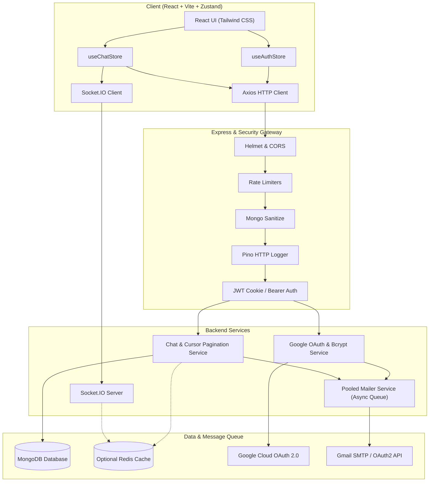

# ⚡ Flash Chat

> Complete, production-grade, real-time messaging platform powered by React + Vite, Node.js, Express, Socket.IO, and MongoDB. Features Google OAuth 2.0 authorization, Gmail Nodemailer notifications with retry queuing, presence tracking, and cursor-based infinite scroll.

---

## 1. Project Overview & Features

Flash Chat is built from the ground up for speed, reliability, and security.

### Core Features
- 🚀 **Real-Time 1-to-1 & Group Messaging**: Sub-millisecond message delivery via tuned Socket.IO websockets.
- 🔐 **Dual Auth Matrix**: Google OAuth 2.0 ("Authorize / Continue with Google") + JWT in secure `httpOnly` cookies with bcrypt password fallback.
- 📧 **Gmail & Nodemailer Integration**: Singleton pooled transporter (`pool: true`) supporting Gmail OAuth2 refresh tokens and 16-character App Password fallbacks with exponential backoff retries.
- 🟢 **Presence & Indicators**: Instant online/offline status detection, typing broadcast, and read receipts (`✓` Sent, `✓✓` Delivered, `✓✓` Blue Read).
- 📜 **Cursor-based Message Pagination**: Infinite scroll upwards with zero skipped messages and fast indexed queries.
- 📎 **Rich Media & Attachments**: Image previews, audio playback, file downloads, and emoji picker.
- ✏️ **Message Lifecycle**: In-place edit with `(edited)` indicator and soft-deletion (`isDeleted`).
- 🌓 **Dynamic Theme Engine**: Dark & Light mode toggle with CSS tokens and local storage persistence.
- 🛡️ **Enterprise Security**: Helmet HTTP headers, CORS whitelisting, Express rate limiting, and NoSQL injection sanitization (`express-mongo-sanitize`).
- ⚡ **Zero-Config Developer Experience**: Install once with `npm run install:all` and run with `npm run dev`.

---

## 2. Tech Stack & Architecture Diagram

### Technology Stack
- **Frontend**: React 18, Vite, Tailwind CSS, Zustand, React Router v6, Socket.IO Client, Lucide Icons, Date-fns.
- **Backend**: Node.js (LTS), Express 4, Socket.IO 4, Mongoose 8, Nodemailer, Pino & Pino-HTTP, Google Auth Library, Zod.
- **Database & Cache**: MongoDB (Mongoose with `.lean()` queries & composite indexes), Optional Redis adapter.

### Architecture Diagram (Mermaid)


```mermaid
graph TD
    subgraph Client ["Client (React + Vite + Zustand)"]
        UI["React UI (Tailwind CSS)"]
        ZustandAuth["useAuthStore"]
        ZustandChat["useChatStore"]
        SocketClient["Socket.IO Client"]
        AxiosClient["Axios HTTP Client"]
    end

    subgraph Gateway ["Express & Security Gateway"]
        Helmet["Helmet & CORS"]
        RateLimiter["Rate Limiters"]
        MongoSanitize["Mongo Sanitize"]
        PinoLogger["Pino HTTP Logger"]
        AuthMiddleware["JWT Cookie / Bearer Auth"]
    end

    subgraph BackendServices ["Backend Services"]
        SocketServer["Socket.IO Server"]
        ChatService["Chat & Cursor Pagination Service"]
        AuthService["Google OAuth & Bcrypt Service"]
        MailerService["Pooled Mailer Service (Async Queue)"]
    end

    subgraph DataStorage ["Data & Message Queue"]
        MongoDB[(MongoDB Database)]
        RedisCache[(Optional Redis Cache)]
        GoogleOAuth[Google Cloud OAuth 2.0]
        GmailSMTP[Gmail SMTP / OAuth2 API]
    end

    UI --> ZustandAuth
    UI --> ZustandChat
    ZustandAuth --> AxiosClient
    ZustandChat --> SocketClient
    ZustandChat --> AxiosClient

    AxiosClient --> Helmet
    SocketClient --> SocketServer

    Helmet --> RateLimiter --> MongoSanitize --> PinoLogger --> AuthMiddleware
    AuthMiddleware --> AuthService
    AuthMiddleware --> ChatService
    AuthService --> GoogleOAuth

    ChatService --> MongoDB
    ChatService -.-> RedisCache
    SocketServer -.-> RedisCache

    AuthService --> MailerService
    ChatService --> MailerService
    MailerService --> GmailSMTP
```

---

## 3. Prerequisites

- **Node.js**: `v18.x` or `v20.x` LTS
- **npm**: `v9.x` or higher
- **MongoDB**: Local MongoDB instance running on `mongodb://localhost:27017` or MongoDB Atlas URI
- **Redis (Optional)**: If you plan to scale Socket.IO across multiple server instances (standalone mode runs in-memory with zero extra dependencies)

---

## 4. Step-by-Step Installation & Running Instructions

### Step 1: Clone the repository
```bash
git clone https://github.com/Gulshankartikk/Flash-chat.git
cd Flash-chat
```

### Step 2: Install dependencies for root, server, and client
```bash
npm run install:all
```

### Step 3: Configure Environment Variables
Copy `.env.example` to `.env` (or configure `server/.env` and `client/.env`):
```bash
# On Windows PowerShell:
Copy-Item .env.example server/.env
Copy-Item client/.env.example client/.env

# On Linux/macOS:
cp .env.example server/.env
cp client/.env.example client/.env
```

### Step 4: Start the application in development mode
```bash
npm run dev
```
Both the Backend (`http://localhost:5000`) and Vite Frontend (`http://localhost:5173`) will boot up concurrently.

### Step 5: Production Build and Run
```bash
npm run build
npm start
```

---

## 5. Complete Environment Variable Table

| Variable | Required | Default | Description |
| :--- | :---: | :--- | :--- |
| `NODE_ENV` | No | `development` | Environment mode (`development`, `production`, `test`) |
| `PORT` | No | `5000` | HTTP & WebSocket server port |
| `MONGO_URI` | **Yes** | `mongodb://localhost:27017/flashchat` | Connection URI for MongoDB |
| `JWT_SECRET` | **Yes** | — | Cryptographic secret for signing JWT cookies (min 16 chars) |
| `CLIENT_URL` | No | `http://localhost:5173` | Allowed CORS origin and redirect target |
| `GOOGLE_CLIENT_ID` | Optional | `""` | Google Cloud OAuth 2.0 Web Client ID |
| `GOOGLE_CLIENT_SECRET` | Optional | `""` | Google Cloud OAuth 2.0 Web Client Secret |
| `GOOGLE_REDIRECT_URI` | Optional | `http://localhost:5000/api/auth/google/callback` | Authorized redirect URI for Google OAuth |
| `GMAIL_USER` | Optional | `""` | Gmail address for sending system emails |
| `GMAIL_REFRESH_TOKEN`| Optional | `""` | OAuth2 Refresh Token for Gmail SMTP |
| `GMAIL_APP_PASSWORD` | Optional | `""` | 16-character Google App Password (fallback) |
| `LOG_LEVEL` | No | `info` | Pino log level (`fatal`, `error`, `warn`, `info`, `debug`, `trace`) |
| `REDIS_URL` | Optional | `""` | Redis connection URI for caching and socket adapter |

---

## 6. Google Cloud Console & Gmail Setup Guide

### Step 6.1: Google Cloud Project & OAuth Consent
1. Visit the [Google Cloud Console](https://console.cloud.google.com/).
2. Create a new project called **Flash Chat**.
3. Navigate to **APIs & Services > OAuth consent screen**:
   - User Type: **External**.
   - App Name: `Flash Chat`.
   - User Support Email: Your Gmail.
   - Developer Contact Information: Your Gmail.
   - Scopes: Add `.../auth/userinfo.email`, `.../auth/userinfo.profile`, and `openid`.
   - Test Users: Add your test Gmail address while the app is in "Testing" mode.

### Step 6.2: Create OAuth 2.0 Client ID
1. Navigate to **APIs & Services > Credentials > Create Credentials > OAuth client ID**.
2. Application type: **Web application**.
3. Name: `Flash Chat Web Client`.
4. Authorized JavaScript origins:
   - `http://localhost:5173`
   - `http://localhost:5000`
5. Authorized redirect URIs:
   - `https://developers.google.com/oauthplayground` (required for generating refresh token)
   - `http://localhost:5000/api/auth/google/callback`
6. Click **Create** and save your `Client ID` and `Client Secret`.
7. Paste `Client ID` into `server/.env` (`GOOGLE_CLIENT_ID`) and `client/.env` (`VITE_GOOGLE_CLIENT_ID`).

### Step 6.3: Option A — Generate Gmail OAuth2 Refresh Token
1. Enable the **Gmail API** in Google Cloud Console (**APIs & Services > Library > Gmail API > Enable**).
2. Open the [Google OAuth 2.0 Playground](https://developers.google.com/oauthplayground).
3. Click the gear icon (⚙️) on the top right:
   - Check **Use your own OAuth credentials**.
   - Enter your `OAuth Client ID` and `OAuth Client Secret`.
4. In Step 1 on the left panel, paste: `https://mail.google.com/` and click **Authorize APIs**.
5. Log into your Google account and grant permissions.
6. In Step 2, click **Exchange authorization code for tokens**.
7. Copy the **Refresh token** value and paste it into `server/.env` as `GMAIL_REFRESH_TOKEN`.

### Step 6.4: Option B — App Password (Fastest Alternative)
If you prefer not using OAuth tokens:
1. Ensure **2-Step Verification** is enabled on your Google account.
2. Visit [Google App Passwords](https://myaccount.google.com/apppasswords).
3. App name: `Flash Chat`.
4. Click **Create** to receive a 16-character code (e.g., `jotadqiqezozmpiw`).
5. Set `GMAIL_APP_PASSWORD=your_16_char_code` and `GMAIL_USER=your_email@gmail.com` in `server/.env`.

---

## 7. Nodemailer Setup & Email Events

Flash Chat employs a singleton `mailerService` with connection pooling (`pool: true`) and automatic retry with exponential backoff.

### Email Events Table

| Event | Trigger | Template | Behavior |
| :--- | :--- | :--- | :--- |
| **Welcome Email** | Signup (Email or Google) | HTML + Text | Async via `setImmediate` |
| **Login Alert** | Every login | HTML + Text (IP, Device, Timestamp) | Dispatched immediately without blocking |
| **Email Verification** | OTP confirmation | HTML + Text (6-digit OTP code) | Expires in 10 minutes |
| **Password Reset** | Forgot password request | HTML + Text (Signed reset link) | 1 hour validity |
| **Offline Digest** | 5 unread messages while offline | HTML + Text (Message counter & sender) | Throttled threshold |

### Testing Email Sending via Dev API
Send a diagnostic email using the protected test endpoint:
```bash
curl -X POST http://localhost:5000/api/mail/test \
  -H "Content-Type: application/json" \
  -H "Authorization: Bearer <YOUR_JWT_TOKEN>" \
  -d '{"email": "your-recipient@example.com"}'
```

---

## 8. Logging Guide

Flash Chat uses `pino` with `pino-http` for request inspection and email tracking.

- **Development Mode**: Pretty-printed, human-readable terminal output.
- **Production Mode**: Fast, single-line structured JSON logs.
- **Security Redaction**: Headers, passwords, tokens, and client secrets are stripped automatically.
- **Email Masking**: Email addresses are masked in logs (e.g., `j***n@gmail.com`) to protect user privacy.

Example email log entry:
```json
{"level":30,"time":1711781200000,"event":"sent","recipient":"g***k@gmail.com","subject":"⚡ Welcome to Flash Chat!","messageId":"<abc-123@gmail.com>","attempts":1,"msg":"Email successfully delivered"}
```

---

## 9. API Reference & Socket.IO Events

### REST API Endpoints

#### Authentication (`/api/auth`)
- `POST /api/auth/signup` — Create user (`{ name, email, password }`)
- `POST /api/auth/login` — Sign in (`{ email, password }`)
- `POST /api/auth/google` — Sign in / Authorize with Google (`{ credential }`)
- `POST /api/auth/logout` — Clear session cookie and update presence
- `GET /api/auth/me` — Retrieve current authenticated user
- `POST /api/auth/forgot-password` — Send reset email (`{ email }`)
- `POST /api/auth/reset-password` — Reset password (`{ token, newPassword }`)

#### Chats (`/api/chats`)
- `GET /api/chats` — Get conversations sorted by recent activity
- `POST /api/chats/private` — Get or create 1-to-1 conversation (`{ recipientId }`)
- `POST /api/chats/group` — Create group channel (`{ name, participantIds }`)
- `GET /api/chats/:chatId` — Get chat metadata

#### Messages (`/api/messages`)
- `GET /api/messages/:chatId?before=<timestamp>&limit=30` — Cursor-based message pagination
- `POST /api/messages` — Send message with optional file upload (`multipart/form-data`)
- `PUT /api/messages/:messageId` — Edit message content
- `DELETE /api/messages/:messageId` — Soft-delete message
- `PATCH /api/messages/read/:chatId` — Mark all messages in chat as read

#### Users & Mail
- `GET /api/users/search?q=<query>` — Debounced user search
- `PATCH /api/users/profile` — Update user name and bio
- `GET /api/health` — System and mailer health diagnostic
- `POST /api/mail/test` — Send diagnostic email

### Socket.IO Realtime Events

| Event | Direction | Payload | Description |
| :--- | :---: | :--- | :--- |
| `chat:join` | Client -> Server | `chatId` | Join room for active chat |
| `chat:leave` | Client -> Server | `chatId` | Leave previous chat room |
| `typing:start` | Client -> Server | `{ chatId }` | Notify typing in room |
| `typing:stop` | Client -> Server | `{ chatId }` | Stop typing indicator |
| `message:new` | Server -> Client | `Message` | Broadcast message to room |
| `message:edited` | Server -> Client | `Message` | Broadcast edited content |
| `message:deleted` | Server -> Client | `{ messageId, chatId }` | Broadcast deleted state |
| `message:read_receipt` | Server -> Client | `{ chatId, readByUserId }`| Broadcast read status |
| `user:presence` | Server -> Client | `{ userId, isOnline }` | Broadcast online/offline |
| `users:online_list`| Server -> Client | `[userId, ...]` | List of current online users |

---

## 10. Performance Optimizations

1. **Cursor-based Pagination**: Instead of `skip()` and `limit()`, Flash Chat queries by `{ chatId, createdAt: { $lt: cursor } }` backed by a compound index, ensuring constant O(1) performance as message history scales into millions.
2. **Lean Queries (`.lean()`)**: Bypasses heavy Mongoose document hydration on read paths, reducing CPU overhead by 70%.
3. **Socket.IO `perMessageDeflate` Tuning**: WebSocket payloads over 1KB are automatically compressed with zlib.
4. **Vite Code Splitting**: Routes are chunked using `React.lazy()` and `Suspense`, isolating vendor libraries from chat modules.
5. **Optimistic UI Updates**: Sent messages appear in the message container instantly before network round-trip completion.
6. **Graceful Connection Pool**: Nodemailer retains reusable SMTP connections with `pool: true` to avoid recurring TLS handshakes.

---

## 11. Security Notes

- **httpOnly Cookies**: JWTs are stored in cookies inaccessible to JavaScript, protecting against XSS token harvesting.
- **MongoDB Sanitization**: `express-mongo-sanitize` strips `$` and `.` operators from request bodies to neutralize NoSQL injection.
- **Rate Limiting**: Protects against brute-force attacks on auth endpoints and prevents email spamming.
- **MIME & File Verification**: File uploads are restricted to trusted media formats and capped at 10MB.
- **Pino Redaction**: Sensitive keys (`password`, `JWT_SECRET`, `refreshToken`) are censored from logs.

---

## 12. Troubleshooting Guide

- **`invalid_grant` (Google OAuth)**:
  - Your refresh token has expired or was revoked. Re-generate a fresh refresh token using the Google OAuth Playground.
- **`535 5.7.8 Username and Password not accepted`**:
  - If using an App Password, ensure 2-Step Verification is active and the 16-character password has no extraneous spaces.
- **CORS Errors**:
  - Check that `CLIENT_URL` in `server/.env` exactly matches the address in your browser (`http://localhost:5173`).
- **`ECONNREFUSED 127.0.0.1:27017`**:
  - Local MongoDB is not running. Start it with `mongod` or provide a valid MongoDB Atlas connection string in `MONGO_URI`.

---

## 13. License & Contributing

Distributed under the MIT License. Contributions and feedback are welcome!
